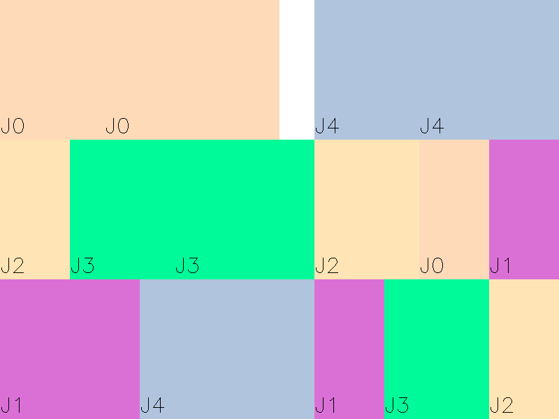
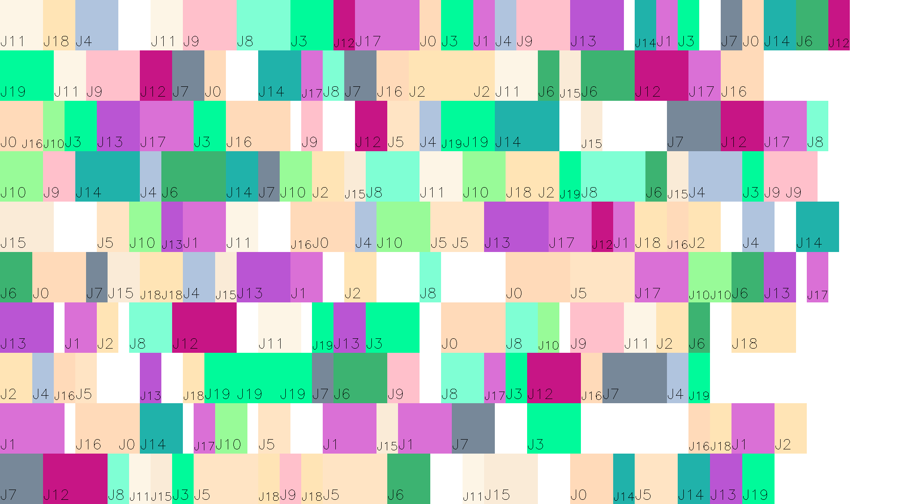

# Gantt Graph 
项目适用于经过FJSP输出后的甘特图绘制。

# 数据组成形式
项目需要两个txt文本文件。一些文本文件示例见examples

第一个文件为已知的机器加工时间表；第二个文件为经过FJSP输出的染色体文件。需要注意的是，示例中的数字都从1开始，但是程序中均转化为0开始。
以下以FJSP中J5P3M3为例。

## J5P3M3染色体文件

```text
3  4  4  2  5  1  1  3  5  2  1  2  4  5  3  1  1  2  3  3  2  2  2  3 2  2  3  3  1  1
```

该文件组成形式由两个染色体组成，工序染色体和机器染色体.他们两个的长度=工件个数*工序数.在这个例子中，前15个元素为工序染色体，后15个元素为机器染色体.
以第一个元素3为例，其代表：第一时刻加工的零件为三号工件，由于是第一次出现数字3，那么认为这是三号工件的第一道工序。又如第三个元素4代表的含义是，这个时刻加工四号工件，
由于是第二次出现4，那么代表加工四号工件的第二道工序。

回到第一个元素3，现在已经知道了第一时刻加工三号工件的第一道工序，那么需要确定使用几号机器进行加工。这时需要这个染色体文件的后15个元素，程序有如下映射代码：
```cpp
--j;
unsigned machineMapIdx = j*PROCESS_NUM+jobs[j].process;//机器染色体对应机器index
unsigned machineIndex = JOBS_NUM*PROCESS_NUM + machineMapIdx; //带有偏置的机器染色体对应机器index
```
最终得到的`machineIndex`指向这个机器，通过`thisarray[machineIndex]`便可获得后半段某个数值，在这里`machineIndex = 5\*3 + 2\*3+0\=21`，即取该数组的第21个元素2。

得到了机器编号，最后需要从机器加工时间表获得3号工件的第一个工序由机器#2加工所需要消耗的时间。下面为加工消耗时间表的组织形式：
```text
3 6 2
5 5 -
5 2 5
- 5 4
2 4 2
6 2 5
- 2 6
6 3 4
5 4 2
2 3 -
- 4 -
6 - 3
5 6 5
3 - 5
4 6 -
```

这个表格描述了消耗时间。3列代表的是3个机器，共15行代表的是五个工件，分别每个工件3个工序。连续的三行代表的一个工件的三个工序。
举例，第二行第二个元素5，代表的含义是一号工件的第二工序由️二号机器加工需要耗时5.

# 客制化指定文件
在`Gantt.h`中修改如下参数：

```cpp
//项目定义
#define CHROMOFILE "../examples/J5P3M3.txt" //染色体文本
#define COSTFILE "../examples/J5P3M3_cost.txt" //工序耗时文本
#define SAVEFILENAME "J5P3M3.png" //输出图片名
#define bSAVEFILE 1 //是否保存文件

const unsigned JOBS_NUM = 5; //工件数量
const unsigned PROCESS_NUM = 3; //工序数量
const unsigned MACHINE_NUM = 3; //机器数量
//画布定义
const unsigned WIDTH = 800;
const unsigned HEIGHT = 600;
const unsigned OPTIMAL_TIME = 16; //已知的最优化时间，用以缩放画布
```

# 运行结果
J5P3M3



其他结果：J20P10M10





